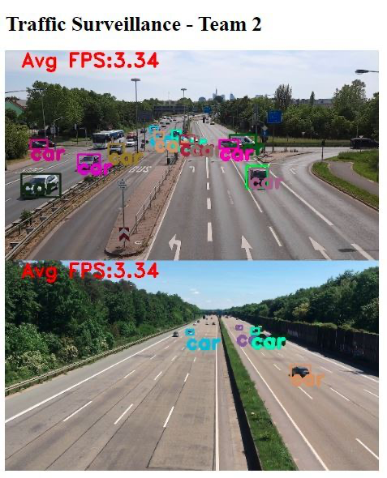

# KWer-ScoUT-2

HIS-Master-Projekt Team 2, SS20

## Introduction

This is a Python based web application using YOLOv3 model and OpenCV library for object detection.

## Prerequisites

Linux OS (Tested on Ubuntu 18.04)  
Python v3.6.8 and higher  

## Cloud Platform Setup

Test and production execution platforms and configuration:  

### Test Environment - Google Colaboratory
- Configuration offered for the free version offered by Colab:  
    : 12 GB RAM  
    : 1 Tesla K80 GPU (12 GB RAM)  
    For more information please refer [this](https://research.google.com/colaboratory/faq.html)  

### Production Environment - Microsoft Azure 
- Configuration we currently use for deploying the app:  
    : NV6 Promo Series  
    : Intel Xeon E5-2690 v6 core CPU, 56 GB RAM, 340 GB SSD  
    : 1 NVIDIA Tesla M60 GPU with 8GB RAM  
    For more information please refer [this](https://docs.microsoft.com/en-us/azure/virtual-machines/nv-series)  
- Virtual Machine Port Allocation:  
    Port 5555 -> Inbound Port : Server port for feed from multiple client streams  
    Port 5860 -> Inbound Port : Server port to show processed video streams  

## Model/Architecture
- We use YOLOv3 object detection model
- The main files for the model include:  
    coco.names : This file consists all the classes to be detected by the YOLO model  
    yolo3.cfg : The model configuration file  
    yolo3.weights : The pre-trained model adjusted weights file   
- For detailed information on YOLO please refer this [link](https://pjreddie.com/darknet/yolo/)  

### SSD & RCNN Models
- We used Single shot object detection (SSD) and Region-based Convolutional Neural Networks (RCNN) models for model comparison purpose
- We customized the code according to our requirement. Actual source code is [here](https://www.pyimagesearch.com/2020/02/10/opencv-dnn-with-nvidia-gpus-1549-faster-yolo-ssd-and-mask-r-cnn/ )
- Scripts are located under <em>model_scripts/</em>

## Dataset
- We have captured few videos and more than 500 images containing different types of vehicles for preparing Image Dataset sourced from [location](https://www.google.com/maps/place/50°08'46.3%22N+8°42'23.1%22E/@50.146201,8.7042163,621m/data=!3m2!1e3!4b1!4m13!1m6!4m5!1m3!2m2!1d8.7064265!2d50.1462014!1m0!3m5!1s0x0:0x0!7e2!8m2!3d50.1462014!4d8.706405) [Near Unfallklinik, Frankfurt am Main]  
- Type of File: JPG
- Dimension: (4000 * 1844, 3264 * 1504, 3000 * 4000)
- We have drawn bounding box on the Image, for this operation, we used one of the widely used Open Source tools LabelImg.
- LabelImg steps are explained in this [link](https://pysource.com/2020/04/02/train-yolo-to-detect-a-custom-object-online-with-free-gpu/)
- Dataset is located under <em>sample-dataset/</em> or can be found [here](https://www.dropbox.com/home/ScoUT-2020)

## Installation
Use the package manager [pip](https://pip.pypa.io/en/stable/) to install the following dependencies:

```bash
pip install imutils
pip install imagezmq (>=1.1.1)
pip install argparse
pip install numpy (>=1.19.0)
pip install flask (>=1.1.2)
pip install pandas (>=1.0.5)
pip install opencv-python (>=4.2.0.34)
pip install matplotlib (>= 3.2.1)
```

### Python Virtual Environment  
We have also created a python virtual environment (using the [virtualenv](https://tecadmin.net/use-virtualenv-with-python3/#:~:text=How%20to%20Install%20and%20Use%20virtualenv%20with%20Python,file%20location%20on%20your%20system.%20Weitere%20Artikel...%20) python package) with all the required packages installed which can be activated using (on cloud instance location : ../Developer/) :

```
. deeplearning/bin/activate
```
## Docker
The Dockerfile generated has all the dependencies with configuration and weights file along with coco dataset. It copies the libraries mentioned in <em>requirements.txt</em> file.  
<br /> 

We have a Docker image created for the complete application ready which can be accessed from the repository using the below command:

```
docker pull shashi4250/scout_team2:objectdetection
```
We need have Image to Server port mapping for running the Docker image as:
```
docker run -p 5860:5860 -p 5555:5555 <docker-image-id>
```

More information on Docker port networking can be found [here](https://docs.docker.com/config/containers/container-networking/)

## GPU based detection - Compiling OpenCV using CUDA and CUDnn

Please refer to following for the complete OpenCV installation with CUDA and CUDnn enabled.  

### CUDA and CUDnn

The main resource we used can be found [here](https://aboustati.github.io/How-to-Setup-a-VM-in-Azure-for-Deep-Learning/)

Please refer to this [guide](https://www.pyimagesearch.com/2016/07/04/how-to-install-cuda-toolkit-and-cudnn-for-deep-learning/) for installing NVIDIA CUDA toolkit and CUDnn library.

CUDA Downloads are [here](https://developer.nvidia.com/cuda-downloads)  
CUDnn Downloads are [here](https://developer.nvidia.com/cudnn)  

We have used following versions on the cloud platform for testing:  
CUDA  : v10.2  
CUDnn : v7.6.5  

### OpenCV
We need to compile OpenCV using cmake for GPU based computations using [link](https://medium.com/@bnarasapur/compile-opencv-with-cuda-from-the-source-1b98e9108a59)

## Folder Structure (Overview)
    |-----mAP_calculator/  ~ Scripts for calculating the performance of various object detection models 
    |-----model_scripts/  ~ Reference SSD & RCNN model scripts 
    |-----sample-dataset/  ~ Sample dataset files 
    |-----Dockerfile  ~ docker file for the application 
    |-----requirements.txt  ~ docker requirements file 
    |-----webappv1.0/ 
            |---- model/  ~ Custom YOLO model 
            |---- res/  ~ YOLO model config files 
            |---- sample-output/  ~ sample output 
            |---- static/  ~ JS files 
            |---- templates/  ~ html files 
            |---- client.py
            |---- server.py
## Usage

### 1. WebApp - Flask webapp
Files associated to this can be found in the <em>webappv1.0/</em> directory.  

*NOTE: BEFORE executing the application, you need to download YOLOv3 weights [file](https://drive.google.com/file/d/1yhp92b8vQaLKHQy5dynxQfI84-0umypL/view?usp=sharing) and place it under the directory <em>webappv1.0/res/</em> with file named as <em>yolov3.weights</em>.  

Please allow connection for TCP port 5555 (used by imagezmq) and TCP port 5860 (used by Flask)

**Server Script:** The server webapp command for accepting video streams from client:
```
python server.py
```

**Client Script:** Clients can send video streams to the server using command:
```
python client.py -s <host ip>  
python client.py -s <host ip> -i test-video.mp4
```
 -s : The IP address of the cloud webapp server    
 -i : If specified source is a video file 
      else (0 - not explicitly described) source is the machine webcam

*NOTE: The Server script must be started and kept running before clients are initialised

#### User Interface & Results

- Web UI : Provides and overall view of all the processed client video streams and the Average FPS  
    <br />   

- JSON Output : Provides a JSON dump with following key-values:
              - timestamp
              - classes detected
              - number of classes detected
```
URL : http://<hostIP:port> /return_vehicle_frequencies  
    {
        "07-Aug-2020 14:58:55": 
        {
            "train": 1,
            "car": 8,
            "person": 1,
            "Camera Name": "LAPTOP-CKIA2NSS"
        },
        "07-Aug-2020 14:58:56":
        {
            "car": 4,
            "person": 2,
            "Camera Name": "Gautams-MBP.fritz.box"
        }
    }
```
Some sample outputs can be found under <em>webappv1.0/sample-output/</em> directory

### 2. mAP_calculator
#### Folder Structure
    |-----mAP_calculator/ 
            |---- __init__.py  ~ script to initiate execution of the application
            |---- extract_coods.py  ~ consists implementations of the 3 methods i.e. YOLO, RCNN and SSD
            |---- perform_operations.py  ~ script for scanning the folders to locate the images
            |---- image_manip.py  ~ contains the Average Precision calculation operations

The core of the application is based on [this](https://towardsdatascience.com/evaluating-performance-of-an-object-detection-model-137a349c517b) and [this](https://ideone.com/HTwJTw)

#### Execution
1.  You need to have a folder consisting of image-text file pair with the same names.
The text file should consist of boundary box coordinates with label identifying the type of object in the boundary box (rectangular shape). For example, consider image-text file pair as
20200518_152832.jpg, 20200518_152832.txt. Below you can see a screenshot of the expected file structure:  
<br /> 
 
    Contents of 20200518_152832.txt:  
    <br /> 
These files can be found in the 'Bounding Box Images with Classes\Image Data Set\'.
First column indicates the type of object. Successive columns indicate the boundary box coordinates 2nd and 3rd column indicate the x center and y center,followed by the columns of width and height.
We have created the text files using the LableImg tool as described previously.  
2. Download the application and run the <em>__ init __.py</em> file. A GUI will popup to select a directory.  
<br /> 

3. Navigate and select the folder containing your image-text file pairs.  
<br />  
4.  In the console search for the key ‘avg_prec’. The value associated to this will be the mAP value for the dataset:  

5. You will also see a separate window showing the Precision vs Recall graph: 
<br />   
 
The 'avg_prec' value and the graph we see is for the SSD algorithm with a MobileNet model. Functions have also been implemented for RCNN and YOLO.  
All the methods and the way to use them can be found in the <em>mAP_Calculator/extract_coods.py</em>

### Contributions  
Created by:  
Gautam Pravin Ingle (1277162)  
Chinmaygopal Voolapalli (1272455)  
Shashi Kamal Jaiswal(1273250)  
Shashikant Kumar(1274301)  
